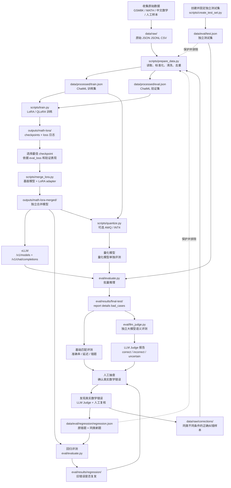

# MathLLM 数据分类、训练与评测全流程

## 1. 文档目的

本文规定 MathLLM 从数据收集到训练、模型合并、推理、评测和错误回归的完整流程，
并说明每个阶段使用什么数据、生成什么文件，以及这些文件能否进入下一阶段。

项目必须始终区分以下四种用途：

```text
原始数据：保存数据来源和人工编写样本
训练数据：让模型学习
验证数据：选择 checkpoint 和调参
测试/回归数据：检查模型效果，不参与训练
```

最重要的边界是：`data/eval/` 中的数据不会被训练数据准备程序扫描，不能复制到
`data/raw/` 中参加训练。尤其是原来答错的题，必须保留在回归集，不能同时复制到
训练集；否则训练后再测这道题会产生数据泄漏。

## 2. 全流程图

下图展示从数据进入项目到错误回归的完整闭环。箭头旁标出了每一步使用的数据和
生成的结果。



图中有两个不同方向的“错误处理”分支：

- `data/raw/corrections/` 中的样本用于下一轮训练；
- `data/eval/regression/regression.json` 中的样本只用于检查错误是否复发。

## 3. 数据目录和文件总表

| 数据/文件 | 数据格式 | 作用 | 参与训练 | 参与验证 | 参与最终测试 |
|---|---|---|---:|---:|---:|
| `data/raw/` | JSON / JSONL / CSV | 原始数据来源和人工样本 | 经过处理后是 | 经过处理后是 | 否 |
| `data/raw/corrections/` | 推荐 JSONL 独立字段 | 同类型纠错训练样本 | 是 | 否 | 否 |
| `data/processed/train.json` | ChatML `messages` | 模型梯度训练 | 是 | 否 | 否 |
| `data/processed/eval.json` | ChatML `messages` | 训练过程中计算 `eval_loss` | 否 | 是 | 否 |
| `data/eval/test.json` | ChatML `messages` | 固定独立测试集 | 否 | 否 | 是 |
| `data/eval/regression/regression.json` | ChatML `messages` | 原错误题和同类新题的专项回归测试 | 否 | 否 | 专项回归 |
| `eval/results/` | JSON / PNG / CSV | 推理和评测输出 | 否 | 否 | 结果保存 |

## 4. 每个阶段的输入、输出和用途

### 阶段一：收集和保存原始数据

输入来源包括 GSM8K、MATH/Hendrycks MATH、中文高等数学/线性代数/概率论题目、
基础代数和应用题，以及人工编写或人工验算的样本。

保存位置：

```text
data/raw/
```

推荐每条样本最终能够提供：

```text
question、solution、answer、source、subject、difficulty
```

原始数据不直接作为最终训练文件使用，统一转换由
`scripts/prepare_data.py` 完成。

### 阶段二：创建独立测试集

使用 `scripts/create_test_set.py` 生成：

```text
data/eval/test.json
```

该文件必须在正式训练前固定。它的题目不能进入训练集或验证集，也不能用于选择
checkpoint。同一份 `test.json` 可以公平比较原始基座模型、LoRA 合并模型、纠错模型
和量化模型。

如果已经查看测试集错误并据此设计训练样本，那么它已经参与开发迭代；此后它适合作为
开发回归依据，正式报告最好另外准备一份从未查看过的新盲测集。

### 阶段三：准备纠错训练样本

当评测确认模型存在真实数学错误时，构造同类型但不同条件的样本，保存到：

```text
data/raw/corrections/
```

纠错训练样本应满足：

- 题目与原错误题不是简单复制；
- 可以改变数字、变量、条件或题目表述；
- 解题过程完整且人工验算正确；
- `answer` 是明确的最终答案；
- 使用原始独立字段，不直接手写 ChatML；
- `source` 使用 `correction-round-1`、`correction-round-2` 等值。

推荐格式：

```json
{"question":"新的同类型题目","solution":"完整且验算过的解题过程","answer":"明确最终答案","source":"correction-round-1","subject":"线性代数","difficulty":"中等"}
```

当前版本的 `prepare_data.py` 会递归扫描 `data/raw/`，因此 corrections 文件会被发现。
并且，只有 `_metadata.source` 以 `correction-` 开头的样本会被强制保留在训练集，不会
随机进入验证集。因此必须正确填写 `source`，不能写成普通的 `manual` 或 `generic`。
原错误题不能放入这个目录；它只能保留在 `data/eval/regression/regression.json`。

### 阶段四：清洗、转换和划分数据

运行：

```powershell
python scripts/prepare_data.py `
  --raw-dir data/raw `
  --regression-dir data/eval/regression `
  --test-file data/eval/test.json `
  --output-dir data/processed `
  --eval-ratio 0.1 `
  --seed 42
```

程序会读取 `data/raw/` 下的 JSON、JSONL 和 CSV，统一字段，清洗空内容和异常标记，
规范化 LaTeX，删除重复/近似重复题目，排除测试集和回归集，固定保留 `correction-*`
样本在训练集，并将其他样本按固定随机种子约 90%/10% 划分。原错误题不应出现在
`data/raw/`，因此不会被转换为训练样本。

输出：

```text
data/processed/train.json
data/processed/eval.json
```

重新加入 corrections 后，必须重新运行本阶段，否则旧的 `train.json` 不会自动变化。

### 阶段五：训练 LoRA/QLoRA

训练程序为 `scripts/train.py`，输入是原始 Qwen 基座模型、
`data/processed/train.json`、`data/processed/eval.json` 和
`configs/train_config.yaml`。输出通常为：

```text
outputs/math-lora/
```

其中包含 checkpoint、训练状态、训练参数和 loss 记录。正式对比实验时，每个实验必须
使用独立输出目录，例如 `outputs/baseline/`、`outputs/ablation-lr-1e-4/` 和
`outputs/correction-round-1/`。

原始的 `math-lora-merged` 是第一轮已经微调过的模型，不是新的原始基座。消融实验应
从同一个原始 Qwen 基座开始；纠错训练可以继续加载旧 adapter，但为了实验公平，更
推荐使用“原始训练集 + corrections”从原始基座重新训练。

### 阶段六：选择最佳 checkpoint

选择依据包括 `eval_loss`、验证集表现、训练稳定性、输出是否截断/重复，以及回归集
是否仍然出现已知错误。不要仅根据最后一个 checkpoint 选择模型。

### 阶段七：合并 LoRA 和基座模型

程序为 `scripts/merge_lora.py`。输入是原始 Qwen 基座模型和最佳 LoRA checkpoint，
输出通常为：

```text
outputs/math-lora-merged/
```

合并会生成新的完整模型目录，不会修改原始基座模型，也不会删除 LoRA adapter。后续
可用合并模型进行 Transformers 推理或 vLLM 部署。

### 阶段八：vLLM 推理服务

服务读取 `outputs/math-lora-merged/`，提供：

```text
GET  http://127.0.0.1:8000/v1/models
POST http://127.0.0.1:8000/v1/chat/completions
```

这一步只负责加载模型和生成答案，不负责判断答案是否正确。

### 阶段九：基础推理和自动评测

程序为 `eval/evaluate.py`，输入是 vLLM 接口和 `data/eval/test.json`，输出示例：

```text
eval/results/final-test/
├── report.json
├── details.json
├── bad_cases.json
├── run_config.json
├── accuracy_comparison.png
└── latency_comparison.png
```

`report.json` 保存准确率、成功/失败数、平均延迟和首 token 延迟；`details.json` 保存
每道题的标准答案、模型原始答案和判定信息；`bad_cases.json` 保存错误或失败样本。
基础评测适合做可重复的工程比较，但格式不同不一定代表数学错误，边界案例应继续
进行 LLM Judge 或人工复核。

### 阶段十：独立大模型语义评测

程序为 `eval/llm_judge.py`，输入是：

```text
eval/results/final-test/details.json
data/eval/test.json
独立评测模型 API
```

输出：

```text
eval/results/final-test/llm-judge/
├── llm_judged_report.json
├── llm_judged_details.json
└── llm_judged_bad_cases.json
```

LLM Judge 判断数学语义，不要求答案文字、LaTeX 或 Markdown 写法完全一致，通常输出
`correct`、`incorrect` 或 `uncertain`。LLM Judge 也可能判断错误，因此不确定和低
置信度样本仍需要人工抽查。API key 只应通过环境变量或安全配置提供，不要提交到 GitHub。

### 阶段十一：错误确认和数据分流

经过基础评测、LLM Judge 和人工抽查后，只有确认属于真实数学错误的样本才进入分流。
原错误题本身不进入训练，只作为回归测试样本：

```text
原错误题
└── data/eval/regression/regression.json
    只用于检查同一个错误是否复发

同类型、不同条件的正确样本
└── data/raw/corrections/
    用于下一轮训练，让模型学习方法而不是背答案

同类型、不同条件的新验证题
└── data/eval/regression/regression.json
    用于检查是否真正泛化
```

不要把原错误题直接加入 `data/raw/corrections/`，也不要把整个 regression 目录复制到
`data/raw/`，否则回归题会进入训练，评测结果会发生数据泄漏。

一条样本只能承担一种角色：原错误题放回归集；同类型新题根据用途二选一。用于学习
方法的同类型新题放 `data/raw/corrections/`，用于检验泛化的同类型新题放
`data/eval/regression/regression.json`，不能把同一条新题同时放进两个目录。

这里的 regression 集不是训练过程中的普通验证集 `data/processed/eval.json`：

- `data/processed/eval.json`：训练期间使用，用于观察 `eval_loss` 和选择 checkpoint；
- `data/eval/regression/regression.json`：训练完成后使用，用于检查旧错误是否复发、
  同类新题是否能够泛化。

### 阶段十二：回归测试

输入是新训练并合并后的模型和 `data/eval/regression/regression.json`，运行：

```powershell
python eval/evaluate.py `
  --model_endpoint http://127.0.0.1:8000/v1 `
  --eval_data data/eval/regression/regression.json `
  --output eval/results/regression-round-1 `
  --temperature 0 `
  --max_tokens 2048
```

输出目录为：

```text
eval/results/regression-round-1/
```

回归测试要回答：原来答错的题是否不再犯同一个错误，以及同类型但条件不同的新题
是否也能正确解决。只有两者都改善，才说明纠错训练可能学到了方法；只答对原题不能
证明模型具备泛化能力。

### 阶段十三：量化和量化后评测

量化程序为 `scripts/quantize.py`，输入通常为合并后的模型
`outputs/math-lora-merged/`。校准数据只能来自训练数据，不能使用
`data/processed/eval.json` 或 `data/eval/test.json`。量化生成独立输出目录后，必须
重新启动 vLLM，并使用同一份测试集、相同的生成参数和相同的评测程序，与未量化模型
进行对比。

## 5. 文件与数据泄漏规则

### 允许的方向

```text
data/raw/ → prepare_data.py → data/processed/train.json
data/raw/ → prepare_data.py → data/processed/eval.json
data/processed/train.json + eval.json → train.py
最佳 checkpoint + 原始基座 → merge_lora.py
合并模型 → vLLM → evaluate.py
test.json → evaluate.py / llm_judge.py
regression.json → 回归评测
```

### 禁止的方向

```text
test.json → data/raw/                 禁止
regression.json → data/raw/           禁止
原错误题 → data/raw/corrections/      禁止
eval.json → 量化校准数据              禁止
test.json → checkpoint 选择            禁止
LLM Judge API key → GitHub             禁止
模型权重和大体积输出 → GitHub          默认禁止
```

## 6. 当前仓库数据状态

截至本说明更新时，仓库中可见的数据文件为：

```text
data/eval/test.json
└── 116 条独立测试题

data/eval/regression/regression.json
└── 4 条回归样本

data/raw/corrections/
└── 当前未发现实际 JSON/JSONL 纠错样本，仅有 README.md

data/processed/
└── 运行生成目录，通常不提交到 GitHub

eval/results/
└── 评测输出目录，不属于训练数据目录
```

因此，下一轮纠错训练前还需要将人工验算后的同类型样本放入
`data/raw/corrections/`，并确保每条样本的 `source` 以 `correction-` 开头。原来的
错误题继续留在 `data/eval/regression/regression.json`，不能复制到 corrections。

## 7. 每轮实验检查清单

### 数据检查

- [ ] `data/eval/test.json` 已固定且没有进入训练集；
- [ ] regression 原题和新题没有复制到 `data/raw/`；
- [ ] 原错误题没有复制到 `data/raw/corrections/`；
- [ ] corrections 样本使用 `source: correction-round-N`；
- [ ] corrections 样本与原错误题条件不同；
- [ ] 同一条新题没有同时放入 corrections 和 regression；
- [ ] 所有解题过程和答案已经人工验算；
- [ ] 重新运行 `prepare_data.py` 后检查训练/验证数量和学科分布；
- [ ] 检查训练集、验证集、测试集和回归集没有重复或高相似题目。

### 训练和模型检查

- [ ] 每个实验使用独立的 `output_dir`；
- [ ] 消融实验从同一个原始基座模型开始；
- [ ] 记录 `train_loss`、`eval_loss` 和最佳 checkpoint；
- [ ] LoRA 合并输出到独立模型目录；
- [ ] vLLM 的 `/v1/models` 和 `/v1/chat/completions` 均正常；
- [ ] 没有 CUDA OOM、请求失败或答案截断异常。

### 评测检查

- [ ] 基础评测使用固定 `temperature` 和 `max_tokens`；
- [ ] LLM Judge 使用独立评测模型；
- [ ] 保存逐题模型答案和原始 API 响应；
- [ ] `incorrect` 和 `uncertain` 样本完成人工抽查；
- [ ] 先完成 regression 回归测试，再报告改进后的盲测结果；
- [ ] 量化前后使用同一份测试集和同一套评测参数。
